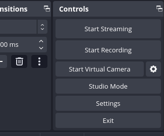
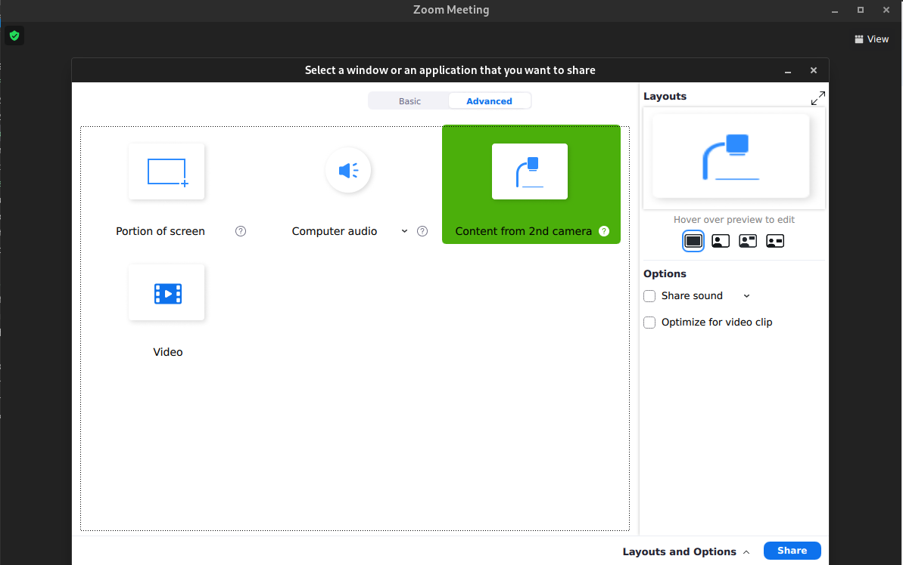

fedora 40 nggk bisa zoom, alhasil pake virtual cameranya si obs

- install dulu si v4l2loopback

  ```
  sudo dnf copr enable sentry/v4l2loopback
  sudo dnf install v4l2loopback
  modprobe v4l2loopback
  ```

- buka obs, maka aka muncul

  

- jalankan Start Virtual Camera
- buka zoom, ketika sharescreen

  
